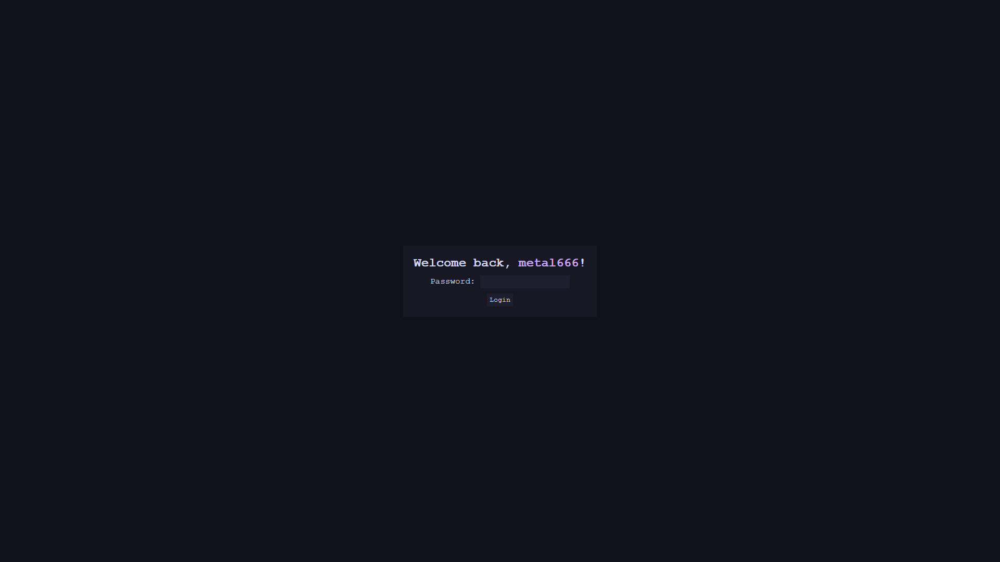

# webtop // Курсова робота з Веб технологій

This project is a desktop simulator that runs in a browser. This was my term paper for the "Web Technologies and Web Design" course. A live demo is deployed to GitHub Pages: https://metal666-nau.github.io/webtop/.

https://github.com/user-attachments/assets/f23719ad-f73c-46a9-a24a-d83b66f5ee7e

## Desktop

The desktop consist of the window area with a customizable wallpaper and a Taskbar on the right. The Taskbar shows currently active apps, system clock and has a ~~Start~~ Launch™ button, which can be used to open the Launch Menu™.

By setting the password in the [Settings](#settings) app, a Lock Screen can be enabled.

## Apps

A set of apps is built into the "operating system". Each app opens in a new window, which can be moved, resized, closed and has a title and an icon.

Internally, each window is a self-contained `.html` file. When an app needs to be launched, a Window Frame is instantiated from a template, then the window `html` file is loaded into the `iframe` element inside the Window Frame.

### File Explorer

Allows browsing the filesystem and opening files. New folders can be created using the button at the top, and navigation can be performed by clicking on the folders or using the breadcrumbs bar at the top. Files can be uploaded by dragging them into the File Explorer. Some files can be opened in other apps (for example `.png`, `.jpg` and other image files will be opened in [Photo Viewer](#photo-viewer) when clicked).

Internally, the files are stored in the browser, using the [Storage API](https://developer.mozilla.org/en-US/docs/Web/API/Storage_API). When navigating through the "filesystem", the `location` object is used (in other words, the `iframe`'s hidden url bar is reused for filesystem navigation). This is also utilized by the breadcrumbs bar to display current path and allow navigating up the folder tree.

### Settings

Allows changing a few settings, including the username and the password (which enables the Lock Screen), the system accent color, setting a wallpaper (from an http URL or a path within browser's storage), and modifying the look of the Taskbar.

### Task Manager

The Task Manager shows currently active apps and allows terminating them.

### Notepad

Can be used to view and edit text documents. Has a text input for entering the document's path (within browser's storage), a save button, and the main text area.

### Photo Viewer

Allows viewing stored images. An image file can be opened both through the [File Explorer](#file-explorer) and by opening the app and entering the file path. When a file is opened, all images in the same directory are loaded as well, for a carousel-like viewing.

### Media Player

Allows viewing stored video and audio files. Has playback controls and an audio volume slider.

## Used demo materials

- Wallpaper: https://github.com/Gingeh/wallpapers/blob/main/landscapes/evening-sky.png
- Sample Video: https://samplelib.com/sample-mp4.html
- Sample Image: https://moewalls.com/pixel-art/power-poles-sunset-pixel-live-wallpaper/
